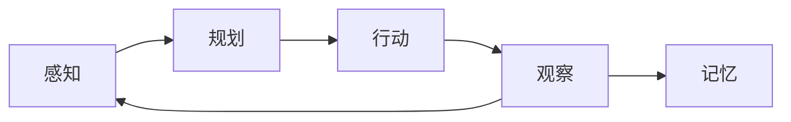

# Agent 是什么

## 一句话定义

**LLM Agent = 大语言模型（大脑） + 工具（手脚） + 循环（思考-行动-观察）。**

它不像传统程序那样由 if/else 规则驱动，而是靠 LLM 的推理能力在每一轮循环中自主决定"现在该思考还是该行动"。本质上，它是一个能使用工具来完成目标的推理引擎。

> 注意：它并**不会在运行中"学习"**（不改变模型权重），而是根据上下文动态调整策略。学习是训练阶段的事，推理阶段是"调用已学会的能力"。

![[Pasted image 20260714173150.png]]

---

## 核心要点

### 智能体的分类

对我而言最容易理解的分类：**反应式、规划式、混合式**，按思考深度和时间维度划分。

![[Pasted image 20260714175557.png]]

现代的 LLM 智能体展现了一种更灵活的混合模式——在“思考-行动-观察”循环中，规划与反应融为一体：

| 阶段                         | 对应                   | 含义                       |
| -------------------------- | -------------------- | ------------------------ |
| **规划（Reasoning）**          | Thought 阶段           | LLM 分析当前状况，规划下一步行动（审议过程） |
| **反应（Acting & Observing）** | Action → Observation | 与外部工具或环境交互，立即获得反馈        |

### 黑箱问题的新理解

传统神经网络（如图像识别）确实是黑箱——你看到输出"这是一只猫"，但不知道它为什么这么判断。

但 **LLM Agent 的"可解释性"比传统神经网络强很多**。因为它的推理过程用自然语言表达出来了：`Thought: 用户需要查询北京的天气...` 这段文字就是 LLM 的"思考过程"。它不是完全的黑箱，而是 **灰色透明箱** ——你能看到它的推理轨迹，只是看不到内部的权重。

不过，"亚符号主义是黑箱"这个说法本身来自传统符号主义 AI 对神经网络的批评，指的是**知识表征方式不可读**：它不是通过学习“猫有四条腿、毛茸茸”这样的显式规则来认识猫，而是在看过成千上万张图片后，神经网络自行形成了“猫”的视觉模式。这种方法强在模式识别和抗噪声能力，弱在不可解释。

---

### 智能体运行机制

#### 环境 — PEAS 模型

精确描述任务环境的框架：

| 字母    | 含义                | 举例（旅行助手）         |
| ----- | ----------------- | ---------------- |
| **P** | Performance（性能度量） | 推荐的景点是否合理、速度是否快  |
| **E** | Environment（环境）   | 互联网上的天气和景点数据     |
| **A** | Actuators（执行器）    | 调用 API 获取天气、搜索景点 |
| **S** | Sensors（传感器）      | 接收用户的自然语言请求      |

几乎所有任务环境都是**序贯**且**动态**的——“序贯”意味着当前动作会影响未来，“动态”意味着环境可能在决策中变化。

#### 感知与行动

![[Pasted image 20260714224808.png]]

**Thought → Action → Observation** 构成了 Agent 的运行骨架。智能体通过这个循环将内部的语言推理能力与外部真实信息结合起来。

关键设计逻辑：
- 每轮思考**自检信息充足度**，信息够就停止 Action 输出
- 框架配置**最大调用轮数**做兜底，杜绝死循环
- 只有信息缺失、需要外部数据时，才会持续走循环

---

### Workflow vs Agent 的根本差异

![[Pasted image 20260714225851.png]]

| | Workflow | Agent |
|--|---------|-------|
| **控制流** | 人预先定义好步骤 | LLM 自主决策下一步 |
| **灵活性** | 固定，改了要重新写代码 | 动态，改 Prompt 即可 |
| **适合场景** | 确定的、重复的流程 | 不确定的、需要判断的任务 |
| **例子** | "每天8点查天气并推送" | "帮我规划明天的北京一日游" |

---

## Agent 的核心循环



---

## 我的理解

Agent 像一个能用**自然语言编程**的计算机：你给我输入，我用"文字组成的程序"来算出结果。只不过它内置的"函数"是灵活可变的——我不需要提前预判你会问什么，你问天气我就调用天气函数，你问景点我就调用景点函数。没有固定路径，只有目标。

---

## ❓ 疑问与解答

### Q1：普通 AI 对话和 Agent 的区别？

> 我在与常见的 AI 进行对话的时候，它也会进行思考，这种思考和 Agent 有什么区别？还是说可以简单地把 Agent 理解为"只加了工具调用的 AI"？

**你的直觉很接近了，但有三个层次的区别：**

| | 普通对话 AI | Agent（简化版） | Agent（完整版） |
|--|-----------|----------------|----------------|
| **调用次数** | 你问一句，它答一句，一次调用 | 可能循环 3-5 次 | 循环 + 记忆 + 规划 |
| **谁控制流程** | 你（人类） | LLM 自己 | LLM 自己 |
| **能做什么** | 回答问题 | 回答问题 + 调工具 | 自主规划 + 调工具 + 记经验 |
| **例子** | 你问"北京天气"，它回复一段文字 | 它先调天气工具 → 得到数据 → 决定是否查景点 → 调景点工具 → 组合答案 |

所以"只加了工具调用的 AI"只是 Agent 的**外在表现**，本质区别是**多轮自主循环**。

类比：普通对话 AI 像只回答一次的自动售货机（投币→出货→结束）；Agent 像一个反复思考、查资料、再回答的研究助理。

---

### Q2：解释器怎么工作的？LLM 为什么会准确选择工具？

> Agent 思考后执行的 Action 是怎么进行的？大模型为什么会这样准确地思考，比如我问天气它就会用 get_weather？

这个问题触及 Agent 设计的核心，拆成三层来回答：

**第一层：LLM 为什么知道该用哪个工具？**

原因很简单——**Prompt 告诉它的。** 看 `agent.py` 中的系统提示词：

```
# 可用工具:
- `get_weather(city: str)`: 查询指定城市的实时天气。
- `get_attraction(city: str, weather: str)`: 根据城市和天气搜索推荐的旅游景点。
```

LLM 读完这段说明，就知道"用户问天气相关的，我该用 get_weather"。这就是 **In-Context Learning（上下文学习）**——不需要重新训练，看一段说明就能按说明执行。

**第二层：代码中的"解释器"（parser.py）做了什么？**

LLM 输出的是自然语言：
```
Thought: 用户需要查询北京的天气，我先调用天气工具。
Action: get_weather(city="北京")
```

parser.py 用正则表达式做了三步：
1. 找到 `Action:` 行 → 提取文本 `get_weather(city="北京")`
2. 提取函数名 → `get_weather`
3. 提取参数 → `{"city": "北京"}`

然后 `agent.py` 做第四步：
```python
available_tools["get_weather"](city="北京")  # 真正执行 Python 函数
```

**完整链条：**
```
你的问题 → Prompt（含工具说明）→ LLM 推理 → 输出文字
→ parser 解析文字 → 提取函数名和参数
→ Python 执行函数 → 得到天气数据
→ 结果送回 LLM → 继续推理 → 最终输出答案
```

**第三层：为什么它不会选错工具？**

它**也会选错**，只是概率低。原因有三：
1. LLM 在训练时看过大量"工具调用"的示例，知道什么场景用什么工具
2. Prompt 中的工具描述写得越清晰，选错概率越低
3. 代码中 `try/except` 就是兜底的——调用失败或结果不合理，LLM 会在下一轮修正

---

## 🔗 关联

- [[LLM基础笔记]]
- 代码实战：[[../learn_output/simple_agent/README.md|simple_agent 项目说明]]
