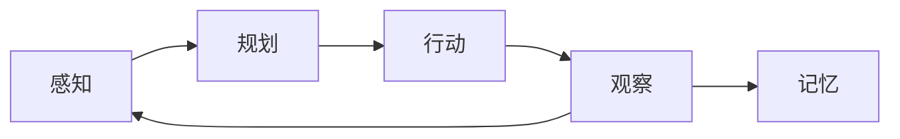

# Agent 是什么

## 一句话定义

大模型驱动下的智能体不再是传统智能体那种受显式逻辑控制的智能体，而是能够不断学习感知外界环境，自行自我规划调动工具后以合理的方式产出结果。
![[Pasted image 20260714173150.png]]
## 核心要点

#智能体分类
对我来说便于理解和接受的分类，反应式、规划式、混合式，按照思考深度思考时间来划分![[Pasted image 20260714175557.png]]
现代的 LLM 智能体，则展现了一种更灵活的混合模式。它们通常在一个“思考-行动-观察”的循环中运作，巧妙地将两种模式融为一体：

- **规划(Reasoning)** ：在“思考”阶段，LLM 分析当前状况，规划出下一步的合理行动。这是一个审议过程。
- **反应(Acting & Observing)** ：在“行动”和“观察”阶段，智能体与外部工具或环境交互，并立即获得反馈。这是一个反应过程。

亚符号主义系统通常被视为一个**黑箱（Black Box）**，这个概念很有意思，这是为什么LLM模型是一个黑箱，他不是通过学习“猫有四条腿、毛茸茸、会喵喵叫”这样的规则来认识猫的，而是在看过成千上万张猫的图片后，大脑中的神经网络能辨识出“猫”这个概念的视觉模式 。这种方法的强大之处在于其模式识别能力和对噪声数据的鲁棒性 。它能够轻松处理图像、声音等非结构化数据，这在符号主义 AI 看来是极其困难的任务。

#智能体运行
- **环境**
通常使用**PEAS 模型**来精确描述一个任务环境，即分析其**性能度量(Performance)、环境(Environment)、执行器(Actuators)和传感器(Sensors)**
几乎所有任务都发生在**序贯**且**动态**的环境中。“序贯”意味着当前动作会影响未来；而“动态”则意味着环境自身可能在智能体决策时发生变化
- **感知与行动**
![[Pasted image 20260714224808.png|697]]
通过这个由 Thought、Action、Observation 构成的严谨循环，LLM 智能体得以将内部的语言推理能力，与外部环境的真实信息和工具操作能力有效地结合起来
智能体每一轮思考都会自检信息充足度，信息足够就停止生成 Action；同时框架配置最大工具调用轮数做兜底，杜绝死循环。只有信息缺失、需要外部数据时，才会持续走 Thought-Action-Observation 循环。
#差异性
- Workflow与Agent 
Workflow 是让 AI 按部就班地执行指令，而 Agent 则是赋予 AI 自由度去自主达成目标。
![[Pasted image 20260714225851.png]]

- 
## Agent 的核心循环

## 我的理解

agent就像是一个能够计算自然语言的计算机，通过你的输入，然后运行自己的计算公式来去得到我需要的结果，只不过它内置的函数是可以变化的，很灵活，因此能够自己运行
## ❓ 疑问

- 暂时没有，你可以对我提出一些问题然后我再进行回答

## 🔗 关联

- 参见 [[LLM基础笔记]]
